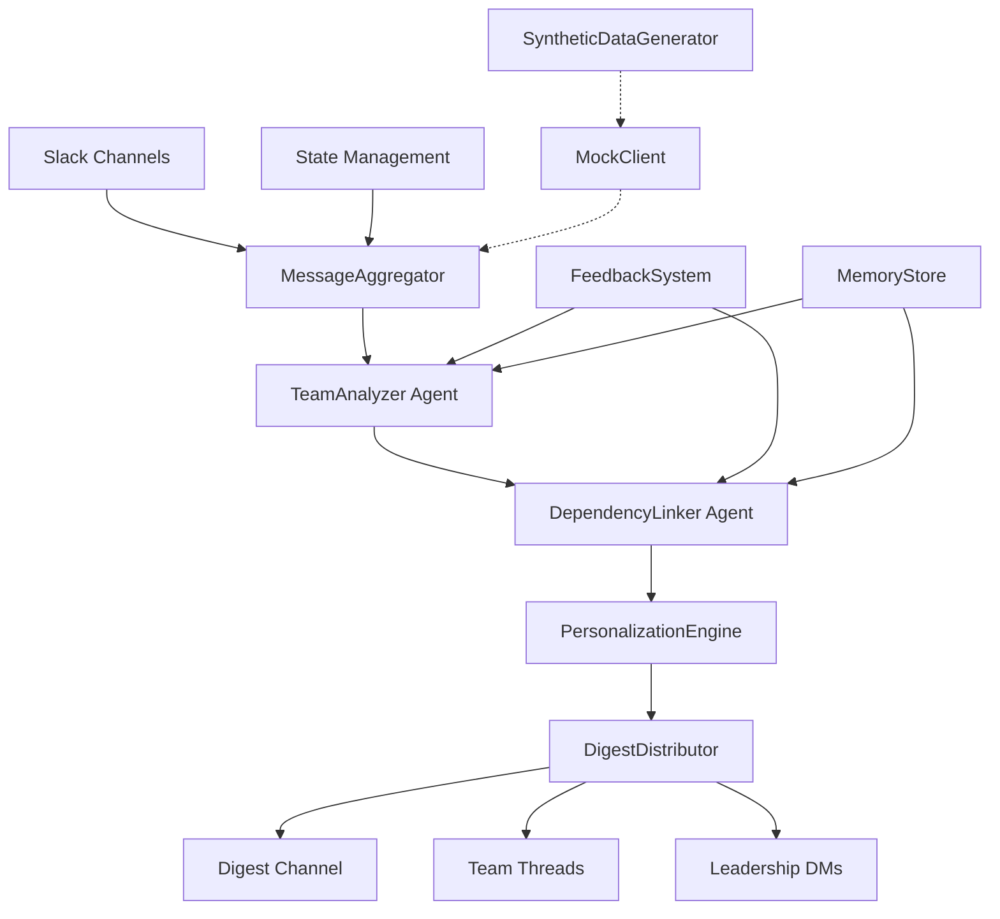

# Design Document

## Overview

The ThreadPilot Daily Digest system is a sophisticated AI-powered platform that transforms raw Slack conversations into actionable team insights. The system employs a multi-stage pipeline architecture that aggregates messages from multiple team channels, applies specialized AI agents for content analysis, detects cross-team dependencies, and generates personalized digests distributed through intelligent routing.

The core innovation lies in the combination of unified team analysis (replacing multiple specialized agents with a single comprehensive analyzer), cross-team dependency detection, and a feedback learning system that continuously improves digest quality based on user reactions.

## Architecture

The system follows a pipeline architecture with five main stages:



### Pipeline Stages

1. **Message Aggregation**: Fetches and filters messages from configured team channels
2. **Team Analysis**: Unified AI agent extracts updates, blockers, decisions, and action items
3. **Dependency Detection**: AI agent identifies cross-team coordination needs and blockers
4. **Personalization**: Ranks and filters content based on user personas and preferences
5. **Distribution**: Intelligent routing of digest content to appropriate channels and users

### Supporting Systems

- **Feedback Learning**: Captures user reactions and improves future analysis
- **Memory Management**: Persistent storage for decisions, blockers, and learning data
- **State Tracking**: Incremental processing to avoid duplicate work
- **Mock Infrastructure**: Development and testing support with synthetic data

## Components and Interfaces

### Core Pipeline Components

#### MessageAggregator
```python
class MessageAggregator:
    def __init__(self, slack_client: SlackClient, config: DigestConfig)
    async def fetch_all_channels(self, since: Optional[datetime]) -> list[ChannelMessages]
    def format_messages_for_llm(self, messages: list[SlackMessage]) -> str
```

**Responsibilities:**
- Fetch messages from configured team channels
- Filter noise and focus on substantive conversations
- Handle both real Slack API and mock data sources
- Format messages for AI agent consumption

#### TeamAnalyzerAgent
```python
class TeamAnalyzerAgent(BaseAgent):
    def analyze_team(self, messages_text: str, team_name: str,
                    channel_id: str, message_count: int) -> TeamAnalysis
```

**Responsibilities:**
- Single unified analysis call per team (replaces 4 separate V1 agents)
- Extract updates, blockers, decisions, and action items
- Generate team summary and tone assessment
- Convert results to standardized StructuredEvent objects

#### DependencyLinker
```python
class DependencyLinker(BaseAgent):
    def detect_dependencies(self, events_by_team: dict[str, list[StructuredEvent]])
        -> tuple[list[Dependency], list[str]]
    def create_alerts(self, dependencies: list[Dependency]) -> list[CrossTeamAlert]
```

**Responsibilities:**
- Analyze events across teams to identify dependencies
- Detect waiting relationships, interface changes, timeline impacts
- Generate cross-team alerts with recommended actions
- Provide highlights for leadership visibility

#### PersonalizationEngine
```python
class PersonaManager:
    def get_combined_persona(self, user_id: str, role_override: str,
                           team_override: str) -> Persona

class ContentRanker:
    def rank_items_for_persona(self, items: list[StructuredEvent],
                              persona: Persona) -> list[RankedItem]
```

**Responsibilities:**
- Combine role-based and team-based personas
- Apply content boosting based on user preferences
- Filter content by minimum severity thresholds
- Rank items by relevance to specific personas

#### DigestDistributor
```python
class DigestDistributor:
    async def distribute(self, output: DigestOutput,
                        team_analyses: dict[str, TeamAnalysis]) -> dict
    async def preview(self, output: DigestOutput,
                     team_analyses: dict[str, TeamAnalysis]) -> dict
```

**Responsibilities:**
- Post main digest to designated channel
- Create threaded replies with team details
- Send direct messages to leadership for high-priority alerts
- Format content using Slack blocks and rich formatting

### Data Models

#### StructuredEvent Hierarchy
```python
@dataclass
class StructuredEvent:
    event_type: EventType
    summary: str
    confidence: float
    source_channel: str
    teams_involved: list[str]
    owners: list[str]
    urgency: str

@dataclass
class Decision(StructuredEvent):
    what_decided: str
    decided_by: str
    context: str
    impact: str

@dataclass
class Blocker(StructuredEvent):
    issue: str
    owner: str
    severity: str
    status: str
    blocked_by: Optional[str]

@dataclass
class StatusUpdate(StructuredEvent):
    what_happened: str
    who: str
    category: str
```

#### Dependency Models
```python
@dataclass
class Dependency:
    dependency_type: DependencyType
    from_team: str
    to_team: str
    what_changed: str
    why_it_matters: str
    recommended_action: str
    suggested_owner: str
    urgency: str
    confidence: float

@dataclass
class CrossTeamAlert:
    title: str
    dependency: Dependency
    priority: int
    alert_id: str
```

#### Persona System
```python
@dataclass
class Persona:
    persona_type: PersonaType
    name: str
    item_boosts: dict[str, float]
    cross_team_weight: float
    topics_of_interest: list[str]
    min_severity_for_main: str
```

### Supporting Infrastructure

#### FeedbackSystem
```python
class FeedbackStore:
    def store_digest_item(self, item: DigestItem) -> str
    def store_feedback(self, event: FeedbackEvent) -> int
    def get_feedback_for_item(self, digest_item_id: str) -> list[FeedbackEvent]

class FeedbackProcessor:
    def apply_item_specific_feedback(self, digest_item_id: str)
    def generate_confidence_adjustments(self) -> dict[str, float]
```

#### MemoryStore
```python
class MemoryStore:
    def process_events(self, events: list[StructuredEvent]) -> dict
    def get_existing_decisions(self, lookback_days: int) -> list[Decision]
    def get_active_blockers(self) -> list[Blocker]
```

#### MockClient Infrastructure
```python
class SlackClient:
    def __init__(self, mock_data_path: Optional[str] = None)
    async def get_channel_messages(self, channel_id: str,
                                  since: Optional[datetime]) -> list[SlackMessage]

class SyntheticDataGenerator:
    def generate_conversations(self, days: int, channels: int) -> dict
    def create_story_arcs(self) -> list[ConversationArc]
```

## Data Models

### Event Processing Flow

1. **Raw Messages** → Slack API format with timestamps, users, threads
2. **Formatted Text** → LLM-consumable format with context preservation
3. **StructuredEvents** → Standardized objects with confidence scores
4. **Dependencies** → Cross-team relationships with action recommendations
5. **RankedItems** → Personalized content with relevance scores
6. **FormattedDigest** → Slack blocks with rich formatting and threading

### State Management

The system maintains several types of persistent state:

- **Run State**: Last successful run timestamp and processed channels
- **Memory State**: Historical decisions and active blockers
- **Feedback State**: User reactions and confidence adjustments
- **Persona State**: User role/team preferences and custom overrides

### Configuration Schema

```python
@dataclass
class DigestConfig:
    channels: dict[str, str]  # team_name -> channel_id
    digest_channel: str
    leadership_users: list[str]
    lookback_hours: int
    max_summary_length: int
    chat_model: str
    temperature: float
```

## Correctness Properties

*A property is a characteristic or behavior that should hold true across all valid executions of a system—essentially, a formal statement about what the system should do. Properties serve as the bridge between human-readable specifications and machine-verifiable correctness guarantees.*

### Property 1: Multi-Channel Message Aggregation
*For any* set of configured team channels, the MessageAggregator should successfully fetch messages from all channels and handle both real Slack API integration and mock data sources with appropriate filtering and error handling.
**Validates: Requirements 1.1, 1.2, 1.3, 1.5**

### Property 2: Comprehensive Team Analysis
*For any* team's message set, the TeamAnalyzer should extract all relevant insights (updates, blockers, decisions, action items) with required metadata fields and convert them to standardized StructuredEvent objects.
**Validates: Requirements 2.1, 2.2, 2.3, 2.4, 2.5, 2.6**

### Property 3: Cross-Team Dependency Detection
*For any* collection of events from multiple teams, the DependencyLinker should identify all types of cross-team dependencies (waiting relationships, interface changes, timeline impacts, resource conflicts) and generate appropriate alerts with recommended actions.
**Validates: Requirements 3.1, 3.2, 3.3, 3.4, 3.5, 3.6**

### Property 4: Feedback Learning System
*For any* user feedback on digest items, the FeedbackSystem should capture, store, and apply the feedback to improve future digest quality through confidence adjustments and prompt directive patches, while preventing duplicate feedback and maintaining pipeline resilience.
**Validates: Requirements 4.1, 4.2, 4.3, 4.4, 4.5, 4.6**

### Property 5: Personalized Content Ranking
*For any* user persona (role and team combination), the PersonalizationEngine should apply appropriate content boosting, topic filtering, cross-team weighting, and severity thresholds to generate personalized digest content that matches the user's preferences and responsibilities.
**Validates: Requirements 5.1, 5.2, 5.3, 5.4, 5.5, 5.6**

### Property 6: Intelligent Digest Distribution
*For any* generated digest content, the DigestDistributor should route information to appropriate channels (main digest, team threads, leadership DMs) with proper Slack formatting, error handling, and support for preview mode without external posting.
**Validates: Requirements 6.1, 6.2, 6.3, 6.4, 6.5, 6.6**

### Property 7: Persistent State Management
*For any* digest pipeline execution, the system should maintain persistent state for decisions, blockers, and run timestamps to enable incremental processing, prevent duplicate reporting, and track resolution status over time, while skipping persistence in mock mode.
**Validates: Requirements 7.1, 7.2, 7.3, 7.4, 7.5, 7.6**

### Property 8: Development and Testing Infrastructure
*For any* testing or development scenario, the system should support mock clients, synthetic data generation with realistic conversation patterns and diverse personas, and both unit and integration testing without external system dependencies.
**Validates: Requirements 8.1, 8.2, 8.3, 8.4, 8.5, 8.6**

### Property 9: Configuration Management
*For any* deployment environment, the system should load all configuration parameters (channels, users, processing settings, AI models) from environment variables with sensible defaults when values are missing, supporting both development and production configurations.
**Validates: Requirements 9.1, 9.2, 9.3, 9.4, 9.5, 9.6**

### Property 10: Comprehensive Observability
*For any* pipeline execution, the system should track and log detailed metrics including message counts, agent performance, event extraction statistics, distribution outcomes, and error information to provide complete visibility into system operation.
**Validates: Requirements 10.1, 10.2, 10.3, 10.4, 10.5, 10.6**

### Property 11: Empty Channel Handling
*For any* team channel with no new messages, the system should generate an empty analysis indicating no activity rather than failing or producing invalid output.
**Validates: Requirements 1.4**

## Error Handling

The system implements comprehensive error handling across all components:

### AI Agent Failures
- **Graceful Degradation**: If TeamAnalyzer fails, return empty analysis rather than crashing
- **Retry Logic**: Implement exponential backoff for transient AI service failures
- **Fallback Responses**: Use mock results in development when AI services are unavailable

### Slack API Failures
- **Rate Limit Handling**: Implement delays and retry logic for API rate limits
- **Network Resilience**: Handle network timeouts and connection failures gracefully
- **Authentication Issues**: Provide clear error messages for token/permission problems

### Data Processing Failures
- **Malformed Data**: Handle unexpected message formats without pipeline failure
- **Missing Dependencies**: Continue processing when optional components fail
- **State Corruption**: Recover from corrupted state files with fresh initialization

### Distribution Failures
- **Partial Success**: Continue with remaining distribution targets if some fail
- **Channel Permissions**: Handle cases where bot lacks posting permissions
- **Message Size Limits**: Truncate or split large messages to fit Slack limits

## Testing Strategy

The system employs a dual testing approach combining unit tests and property-based tests for comprehensive coverage:

### Unit Testing
Unit tests focus on specific examples, edge cases, and integration points:
- **Component Integration**: Test interactions between MessageAggregator and SlackClient
- **Error Conditions**: Test specific failure scenarios and error handling paths
- **Edge Cases**: Test empty inputs, malformed data, and boundary conditions
- **Mock Validation**: Verify mock clients behave consistently with real implementations

### Property-Based Testing
Property tests verify universal properties across all inputs using a minimum of 100 iterations per test:
- **Data Processing**: Generate random message sets and verify extraction consistency
- **Personalization**: Generate random personas and content to verify ranking behavior
- **State Management**: Generate random sequences of operations to verify state consistency
- **Configuration**: Generate random configuration sets to verify system behavior

### Testing Configuration
- **Framework**: Use pytest with hypothesis for property-based testing
- **Iterations**: Minimum 100 iterations per property test for statistical confidence
- **Tagging**: Each property test references its design document property
- **Coverage**: Aim for >90% code coverage combining unit and property tests

### Test Data Management
- **Synthetic Generation**: Use SyntheticDataGenerator for realistic test conversations
- **Fixture Management**: Maintain versioned test fixtures for regression testing
- **Environment Isolation**: Ensure tests don't interfere with production data or state

The combination of unit tests (for specific scenarios) and property tests (for universal behaviors) provides comprehensive validation that the system behaves correctly across all possible inputs and configurations.
